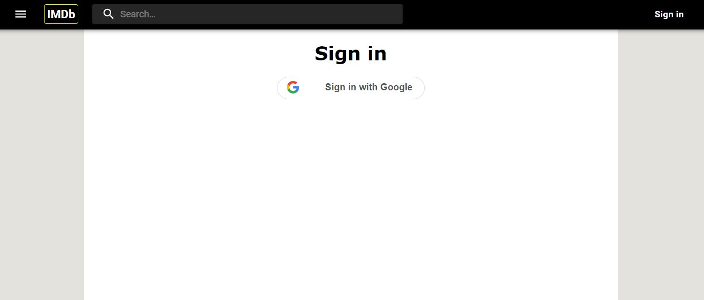

# **IMDb**

## **Concordia full-stack web development bootcamp - Final Project**

### **Description**

Web-based application helping users to find information related to films and television programs. Users are also given options on how to watch the films and shows.

### **Features**

- Dynamic buttons show `Sign in`, `Add to watchlist` or `Watchlist` depending on the app and general states
- Dynamic search into the movie database based on movie titles
- Play a short preview of the movies or shows
- See posters and pictures from a movie or show through a carousel
- Option to buy or rent the movie through the app, or wath it online if available on major streaming platforms
- Movies or shows organized by themes and displayed through carousels
- Show a movie or show details

### **Language/libraries used**

Front-end:

- Javascript ES6
- HTML5
- CSS3
- React
- React-Redux
- React-Router-dom
- React-google-login
- Material-ui
- Styled Components

Back-end: (To be implemented)

- Express
- Multer
- MongoDB

### **Video Run-through**

(To come ...)

### **Screenshots**

